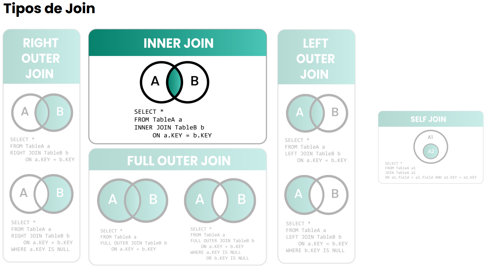
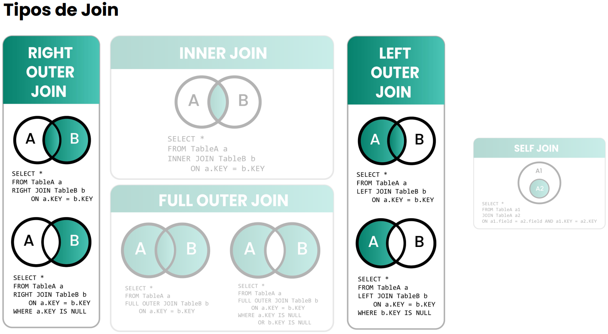
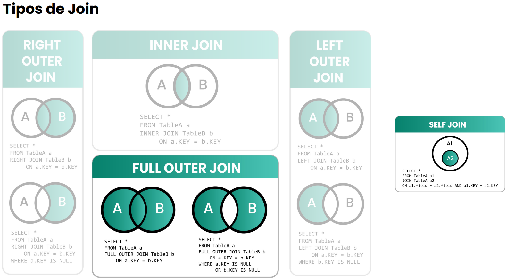

# Estudos_em_MySQL
Este é um repositório para registrar os arquivos das aulas de MySQL.

Os módulos contidos aqui foram feitos utilizando MySQL Workbench. 

Os módulos são organizados numericamente pela ordem vista no curso e o conteúdo é agregado
de um módulo para outro. Ou seja, um módulo avançado pode utilizar de conteúdos vistos
ou de etapas executadas em um módulo anterior. 

# Módulos
## Linguagem de Definição de Dados (DDL)
- Criação, alteração e exclusão de tabelas através dos comandos "CREATE TABLE", 
"ALTER TABLE" e "DROP TABLE".

## Linguagem de Manipulação de Dados (DML)
- Inserção, alteração e exclusão de dados nas tabelas através dos comandos "INSERT INTO",
"UPDATE" e "DELETE FROM".

## Linguagem de Consulta de Dados (DQL)
- Consulta à tabelas através do comando "SELECT";
- Filtragem de dados através do comando "WHERE";
- Ordenação e limitação de dados através dos comandos "ORDER BY", "LIMIT" e "OFFSET". 

## Filtros e Condicionais
- Utilização de operadores lógicos "AND", "OR" e "NOT" em filtragens;
- Utilização de operadores "IN", "BETWEEN" e "LIKE" para filtragens avançadas;
- Tratamento de valores nulos e não nulos através dos comandos 
"IS NULL", "IS NOT NULL", "IFNULL" e "NULLIF".

## Agregações 
- Utilização de funções de agregação como "COUNT", "SUM", "AVG", "MAX" e "MIN";
- Agrupamento dos dados através do comando "GROUP BY";
- Diferenciação entre a utilização dos comandos "WHERE" e "HAVING" para filtragem.

## Consultas em múltiplas tabelas
- Consultas entre múltiplas tabelas através dos diferentes tipos de JOINs:
  - INNER JOIN
  - LEFT JOIN
  - RIGHT JOIN
  - FULL JOIN
  - SELF JOIN
  - NATURAL JOIN
- Boas práticas como a preferência por Left ao invés de Right join e evitar o uso de NATURAL JOIN;
- Subconsultas em SQL (Consultas dentro de consultas)

## Consultas avançadas
- Uso de VIEW para simplificar e otimizar acesso aos dados das tabelas;
- Uso de PROCEDURE e FUNCTION.
